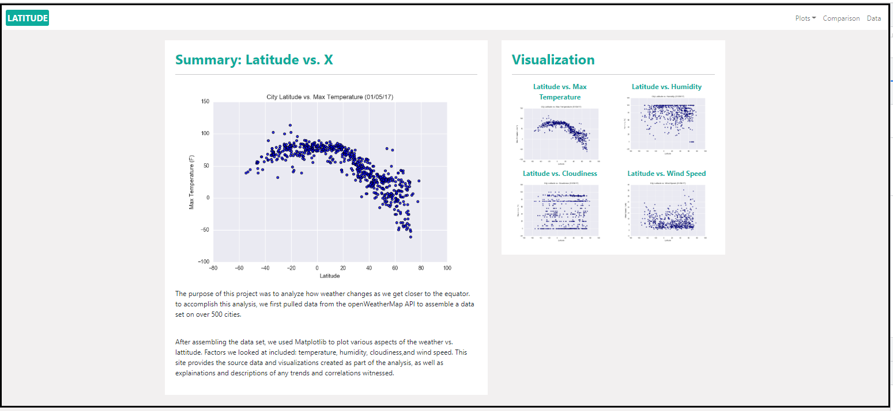

# Unit 11 Homework: Weather Analysis Dashboard

## Assignment Overview

Data becomes more powerful when we share it with others! That’s because people can use our data only if they can access it. So, used HTML and CSS to create a 'Weather Analysis Dashboard' featuring the Latitude vs. X analysis of weather. 

## Weather Analysis Dashboard
A GitHub Pages deployable 'Weather Analysis Dashboard' was created using the weather data and images provided for this Challenge. The dashboard includes seven navigable pages. 

### Landing Page
Landing page  has the following components:
  * A navigation bar
  * A sidebar section with images of each plot that all load
  * Sidebar images link to their respective pages
  * Bootstrap grid used correctly to separate sections
  * Page is responsive when the window is reduced in size
  * An explaination (summary) of the project  

  

### Visualization Pages
Visualization page for each of the following:
  * latitude vs. max temperature
  * latitude vs. humidity 
  * latitude vs. cloudiness 
  * latitude vs. wind speed 

Every visualization page has the following components:
  * A navigation bar
  * A descriptive title and a heading tag
  * A section with the regular-sized visualization image, with the image correctly loading
  * A sidebar section that displays a smaller version of all the visualization images
  * All sidebar visualization images link to their respective pages
  * Uses Bootstrap grid to separate sections 
  * Page is responsive when the window is reduced in size
  * Includes a paragraph of text describing the plot  

### Comparison Page 
Comparison page has the following components:
  * A navigation bar
  * All Images load on the same page (for easy comparison)
  * Uses Bootstrap grid for visualization
  * Images are responsive (2x2 on large screens and 4x1 on small screens)
  * All images link to their respective visualization page
  
### Data Page
Data page has the following components:
  * A navigation bar
  * The table uses Bootstrap table class
  * The table is responsive and stays inside a container when the page is reduced in size 
  * The table has all 10 columns (City_ID, City, Country, Date, Latitude, Longitude, Cloudiness, Humidity, Max Temperature, Wind Speed) 
  * The CSV data file used to produce the data page is included in the submission on GitHub in a Resources folder
  
## Navbar
Navbar has the following components:
  * Uses Bootstrap navbar class
  * The name of the site is on the left side of the navigation bar and links to the landing page
  * All links direct to the respective page 
  * Navbar has a working dropdown with links to plot pages
  * Navbar is on every page 
  * Navbar collapses when the window is reduced in size and button works to make nav reappear 
  
## File Organization and Structure 
Submitted files include the following structure:
  * Visualization pages (cloudiness.html, humidity.html, temp.html, and wind.html) are stored within a visualizations folder
  * An assets folder contains the css and images folders 
  * CSS file(s) are stored within the css folder 
  * Plot images are stored within the images folder 
  * index.html, comparison.html, and data.html are stored in the parent directory
  
## References
OpenWeatherMap.org. (2012). Сurrent weather and forecast. Retrieved from https://openweathermap.org/ Links to an external site.  

